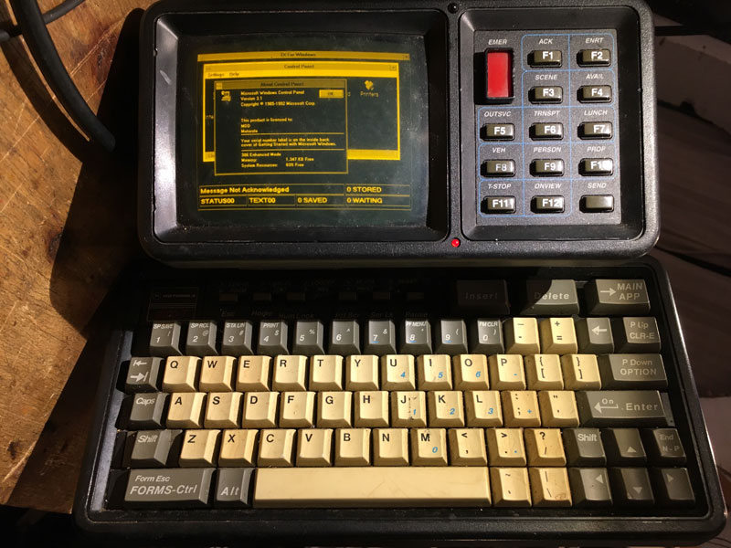

===============
What is Bashrc?
===============

Before we answer the title question we must first explain what a *terminal* is.

You probably have at least seen an image of one of these even if you haven't seen one before.
It is a physical machine to interface into a computer. Nowadays, instead of needing a full machine to be a terminal,
we can spin up a GUI (Graphical User Interface) application like Terminator that we downloaded in the installation guide.

*A terminal is just the GUI application*

.. image:: ../../_static/terminator.png
   :alt: terminator
   :class: with-shadow
   :scale: 50

The application is a *terminal*, but the program that the *terminal* runs is a *shell*. The *shell* is what displays the text
and allows you to execute commands. The *shell* is an interface with the operating system.

In this image you can see a variety of outputs, including one which says ``Shell: bash 5.0.17``. This means that my *shell* is "bash".
Bash is the default in Ubuntu. The default for MacOS is "zsh". `Install zsh`_.

Now let's answer the question
~~~~~~~~~~~~~~~~~~~~~~~~~~~~~

Now we have explained what the difference is between a shell and a terminal let's answer the question. What is bashrc?
    \| *bashrc stands for "bash run commands"*

Think of it like a configuration file. Any script you want to run to setup your shell, such as an alias so you can type ``cb`` instead of ``colcon build``, place
inside of your .bashrc file. Everytime you launch a terminal or a new shell instance, the .bashrc file will be ran and configure your environement to your wishes.
One neat application of this file is to install plugins. zsh is an alternate shell to bash (think of these like programming languages with different features) and as
such has a .zshrc instead. To view this file run ``gedit ~/.bashrc``.

Install zsh
-----------

I personally like zsh because it supports theming your shell. To install zsh run:

.. code-block::

    sudo apt update
    sudo apt upgrade
    sudo apt install zsh
    chsh -s /bin/zsh

Install oh-my-zsh to manage plugins (if you want):

.. code-block::

    sh -c "$(curl -fsSL https://raw.github.com/ohmyzsh/ohmyzsh/master/tools/install.sh)"

Install the powerline theme (if you want):

.. code-block::

    git clone --depth=1 https://github.com/romkatv/powerlevel10k.git ${ZSH_CUSTOM:-$HOME/.oh-my-zsh/custom}/themes/powerlevel10k

Open up a file name ``~/.zshrc`` by typing ``gedit ~/.zshrc`` and find the line starting with ``ZSH_THEME`` and replace it with ``ZSH_THEME="powerlevel10k/powerlevel10k"``
